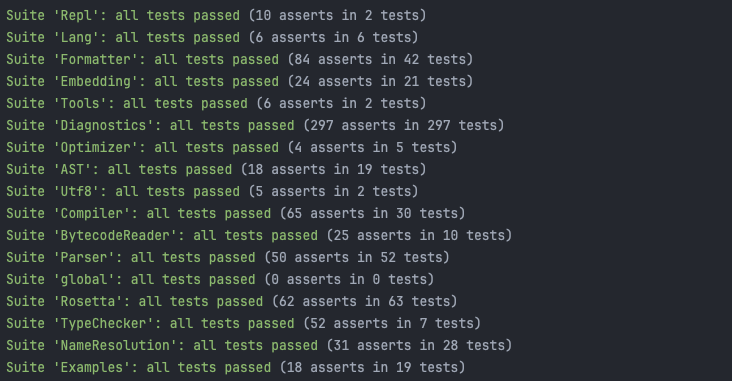

Since the [last update post](), there was a total of 102 commits, for 947 files changed, 9395 insertions, 3149 deletions. I mainly focused on test coverage, adding around a hundred tests on type checking errors.

## Mordor... erm more documentation

The documentation for the bytecode instructions is (finally!) automatically generated thanks to [a small Python script I wrote](https://github.com/ArkScript-lang/Ark/blob/f62ca46c7dcebeabc3bdc6a0cd62d3352a61eae3/docs/gen_instructions_documentation.py). No more editing this monstruous file by hand when a new instruction is added and I need to change all the instruction value, again. If you are curious about what it looks like, checkout [arkscript-lang.dev/bytecode](https://arkscript-lang.dev/bytecode.html#instructions)!

## Tests!

Testing is hard, but testing interactive programs *inside a CI* is even harder. Which is why I didn't test the REPL until very recently, and also why it was so frequently broken without me noticing...

Using Python and the **pexpect** package, I can finally test the REPL and ensure it can autocomplete code. I tried testing for colored output, to ensure that code coloration also works, but since it depends on the system and shell you are running, I just gave up (and so should you, it's not worth it IMHO).

The script is quite small too: [repl/test.py](https://raw.githubusercontent.com/ArkScript-lang/Ark/029de7012cac0e279912cec4af3785cd2929dc87/tests/repl/test.py).

I also worked on Rosetta code problems, and added [as many as I could to the wiki](https://rosettacode.org/wiki/Category:ArkScript), which are also new tests! Everyone is welcome to contribute as the wiki is open.

333 tests written in ArkScript, 194 tests for the standard library, plus around a thousand golden tests makes 1'284 tests for 86% coverage!



## Misc

1. `random` is now a builtin because I couldn't be bothered to import a module anymore
2. I added a *unity build* option, which helps compiling the project faster, allows more compiler side optimizations, and helps detecting ODR violations. It basically creates 3 files and `#include` a bunch of `.cpp` files together, to make bigger *transpilation units* the C++ compiler can work through
3. Last but not least, I **finished** the `http` module! I choose to delete the server handling part, because it's a ton of work to make it viable, and being able to make HTTP(S) requests was enough for me. It's also well tested, on all HTTP verbs (GET, POST, PUT, PATCH, and DELETE): [modules/src/http/tests/main.ark](https://github.com/ArkScript-lang/modules/blob/1438b399a5b6976339d3a194bbb0385a2043896e/src/http/tests/main.ark)

## Bytecode and VM updates

ArkScript compiler was very dumb, and used to serialize number constants as strings, which resulted in a precision loss and this kind of hacks: [Mercerenis/eulers-melting-pot](https://github.com/Mercerenies/eulers-melting-pot/blob/edc6a12d1619dc8ffce679f9babbd5488170a3f9/problem142.ark#L9-L12). It annoyed me as this was also a blocker when making somewhat precise computations in ArkScript, so I just ripped it up and we're now serializing numbers using their IEEE 754 representation.

It's a bunch of `bit_cast` and then relying on `std::frexp` to get the mantissa and exponent of a `double` as integers we can serialize. In the end, we serialize an 8 bytes double to 12 bytes of integers (4 for exponent and 8 for the mantissa), with only 1.0842 &times; 10<sup>-19</sup> of precision loss. [Implementation here](https://github.com/ArkScript-lang/Ark/blob/d99cdb467dd0a084e28507a6f4c4f4f25d8d01bc/include/Ark/Compiler/Serialization/IEEE754Serializer.hpp).

### Another (less useful) bytecode change

As a little treat, I made a small quality of life update when using a hexeditor to read `.arkc` bytecode files (because I have to debug bytecode files once in a blue moon): the table start bytes are now `0xA_` and the value type tags are `0xF_`, making them standout more.

### A more useful bytecode change: new symbol loading instruction

Loading symbols in ArkScript is costly, as we rely on their identifier: `LOAD_SYMBOL <id>` will load the symbol with the given id in the nearest scope. This requires looking through each scope in reverse order (look in the current one first, then the parent... etc), and scopes are just vectors of tuple `(identifier, value)`, not hashmaps because it would have made the whole thing slower (compared to just iterating through the vectors, with a bloom filter on the identifiers).

This new instruction is `LOAD_SYMBOL_BY_INDEX <index>`, with the index being related to the current scope stack of values. An index of 0 means "the last value we registered", 1 means "the previous", etc. It makes symbol loading faster, as we went from a O(m &times; n) to O(1) access (m= number of scopes, n= number of variables per scope).

Why stop there? Scopes are no longer a `vector<shared_ptr<Scope>>` but stored as `vector<ScopeView>`. A ScopeView is like a std::string_view, and the backend for storing locals is a big contiguous `array<pair<identifier, Value>, 4096>`. Since locals are now stored contiguously, it’s more cache efficient, and yields overall better performance, even without the new instruction! For more details, checkout [this article I wrote about optimizing scopes data]().

## Better error messages, finally at runtime

For a long time, runtime error messages looked like garbage, presenting the user with an error string like "type error: expected Number got Nil" and some internal VM info (instruction, page, and stack pointers). Then, you had to guess where the error occurred. I have wondered for a long time how that could be improved, and I only started working on that a few weeks ago.

And here we are, with way better runtime error messages:

```
ArityError: When calling `(foo 1 2 3)', received 3 arguments, but expected 2: `(foo a b)'

In file a.ark
    1 | (let foo (fun (a b) (+ a b)))
      | ^~~~~~~~~~~~~~~~~~~~~~~~~~~~
    2 |
    3 | (foo 1 2 3)

[   2] In function `foo' (a.ark:1)
[   1] In global scope (a.ark:3)

Current scope variables values:
foo = Function@1
At IP: 0, PP: 1, SP: 5
```

To make this work, I added more data to the bytecode, in the form of two tables: one to hold the name of the files that were involved in producing the bytecode, and one to map a tuple `(instruction ptr, page ptr)` to a `(file id, line)`. You can read more about it [here!]()
## Tasks done


Since the last update, this is 48 more tasks (done + to do) in the tracker, with a big focus on tests, coverage, and code improvement. Hopefully I can keep going with the standards I choose for my code, and I shall be working on more tests during the next month(s), focusing on benchmarking using [Codspeed](https://codspeed.io)!

