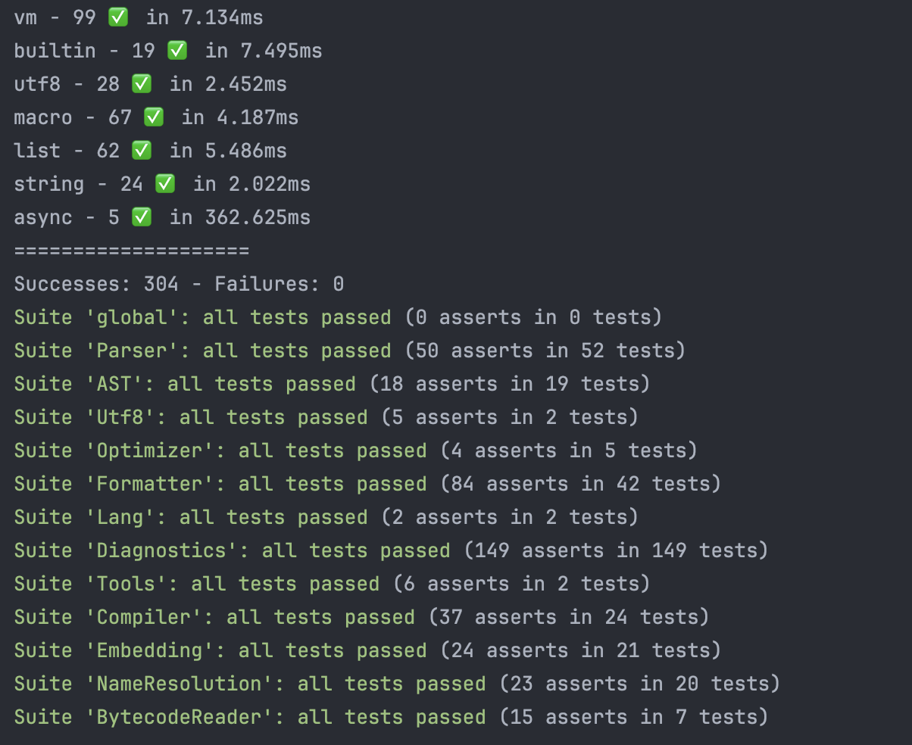
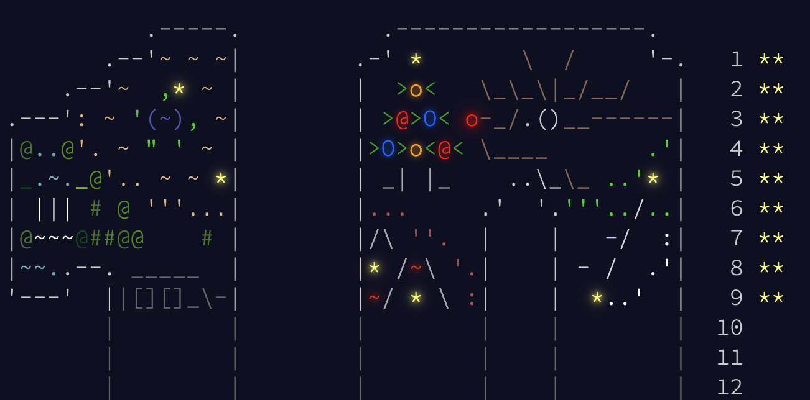

Hello there!

In the last 90ish days, there were 841 files changed, 9323 insertions, and 5070 deletions, in 106 commits. The primary goal was integrating an intermediate representation, but then... I got side tracked.

## Compiler ire...?

The compiler didn't get angry, but now outputs instructions in a new **intermediate representation** (IR), that is then compiled to bytecode for the virtual machine!

Why the extra step, you might ask? I wanted to be able to add *super instructions*, which relies on merging some instructions together to do more in a single instruction. Introducing an IR that is easy to handle seems like a good fit for this task. We could have a `LOAD_CONST_STORE` instruction, to avoid pushing to the stack and then popping, and much more small improvements like this.

Introducing this IR didn't change anything, as it is 96% based on the instruction set. The small difference is how we have to handle jumps: since we want to be able to merge instructions, jump offsets might change. If you're interested about this, go read [Implementing an IR for ArkScript](https://lexp.lt/posts/implementing_an_intermediate_representation/). The compiler now outputs IR entities, that the IR compiler compiles to bytecode.

This IR looks like this when dumped (useful for analysis, better than comparing byte codes):

```
page_0
	LOAD_CONST_STORE 0, 0
	LOAD_CONST_STORE 1, 1
	CREATE_SCOPE 0
.L0:
	LOAD_SYMBOL 1
	LOAD_CONST 2
	LT 0
	GOTO_IF_FALSE L1
	INCREMENT 1, 1
	STORE 0
	LOAD_SYMBOL 0
	CALL_BUILTIN 9, 1
	POP 0
	SET_VAL_FROM 0, 1
	GOTO L0
.L1:
	POP_SCOPE 0
	LOAD_SYMBOL 0
	CALL_BUILTIN 9, 1
	HALT 0
```

## More optimizations!

One optimization I wanted to work on, as said earlier, was to implement *super instructions*, basically merge two or more instructions together. As of today, those are:

- load multiple values at once on the stack
- load a value and store it in a variable
- copy a variable into another
- increment / decrement a variable by `n`
- store the tail / head of a list in a variable
- load a builtin `i` and call it with `n` arguments already on the stack

I also finished implementing [computed gotos](https://lexp.lt/posts/computed_gotos/), which yielded a 10-15% overall performance improvement! For those unaware, *computed gotos* is like a while-switch, reading instructions one after the other, running it, and looping back up, but better for your CPU as it pleases way more the branch predictor. Thus, code is faster as the branch has an easier time learning jumps between instructions.

In this benchmarks report, we compare with: a baseline, then computed gotos, then super instructions + computed gotos (`{benchmark_id}-{commit_id}`):

```
                          |           | 5-57d0e0cd   | 6-c7f632ff          | 7-28999c0f
--------------------------+-----------+--------------+---------------------+---------------------
 quicksort                | real_time | 0.190424ms   | -0.022 (-11.3935%)  | -0.036 (-18.6841%)
                          | cpu_time  | 0.179065ms   | -0.011 (-5.8917%)   | -0.024 (-13.6537%)
 ackermann/iterations:50  | real_time | 78.6985ms    | -10.388 (-13.2004%) | -17.667 (-22.4485%)
                          | cpu_time  | 78.5711ms    | -10.337 (-13.1561%) | -17.596 (-22.3949%)
 fibonacci/iterations:100 | real_time | 7.43315ms    | -0.807 (-10.8582%)  | -0.967 (-13.0118%)
                          | cpu_time  | 7.42263ms    | -0.804 (-10.8377%)  | -0.965 (-13.0013%)
 man_or_boy               | real_time | 0.016108ms   | 0.001 (5.3210%)     | -0.000 (-2.7713%)
                          | cpu_time  | 0.0160867ms  | -0.000 (-0.3972%)   | -0.000 (-2.7551%)
```

Overall a pretty decent set of performance improvements! For now, I'll stop working on such huge refactors and optimizations, and focus on new builtins, enhancing the standard library, the documentation, the tests coverage...

## Coverage report

Which makes a nice segway for this section! I've worked on new functionalities, more optimizations, but that didn't stop me from adding five new test suites and about 90 more tests!



The new test suites:

- **Optimizer** tests the AST optimizer, and dead code elimination
- **Utf8** tests the utf8 library (decoding / encoding utf8 codepoints)
- **Tools** tests the C++ helpers (eg our implementation of Leveinshtein distance)
- **Compiler** tests the IR optimizer by dumping IR and checking that super instructions have been used
- **NameResolution** tests the namespaces resolution, hidding variable, prefixing them...

The biggest test suite to have been upgrade is the **Diagnostics** one, with more 70 new tests, testing even more error messages to ensure we still detect them in the future. I also finally fixed the line reporter of the parser, and tokens are *finally* underlined correctly:

```
# before
At a @ 2:9
    1 | (let a [])
    2 | (pop! a 1)
      |         ^
    3 |
        MutabilityError: Can not modify the constant list `a' using `pop!'


# after
At a @ 2:7
    1 | (let a [])
    2 | (pop! a 1)
      |       ^
    3 |
        MutabilityError: Can not modify the constant list `a' using `pop!'
```

Thanks to this, the [coverage](https://coveralls.io/builds/71349925) jumped from 73% to 79%!

## Finally done with imports!

This section was a bit spoiled earlier when I mentioned *name resolution*... It's about the new import system! Yes, the one I started working at the end of 2022!

We can finally import symbols from files (also called "packages" now), import files with prefix, or just import a few names from a file:

```
# import all, with a prefix
(import std.List)
(list:map [1 2 3] print)

# import only a few symbols
(import std.Math :even)
(print (even 5)) # false

# import all symbols without a prefix
(import std.String:*)
(print (reverse "hello")) # olleh
```

For now, files are imported "à la Python", you specify a package that's resolved from your current directory. Eg, `(import foo.bar.egg)` would search for `$CWD/foo/bar/egg.ark`, with `$CWD` being the current working directory of the script. The standard library gets a special treatment, you can write `std.List`, `std.Math`... from anywhere and import anything from the standard library.

All the work was done in the name resolution pass, that's now done right after processing macros, so that all names are computed (some variable names can be created by macros). If you want to learn more about the inner workings of this monstruosity, [I wrote an article about it!](https://lexp.lt/posts/designing_a_better_import/)

**TL;DR**: Once files are parsed, and the **Import Solver** has had a go at resolving `imports` and merging them, we are left with a single big AST, with `Namespace` nodes (multiple imports of a single file are merged together). Then, a new compiler pass, the **Name Resolution**, can register all symbols along with their prefix (if in a namespace), and replace them in another AST visit with their fully qualified name (this way, we avoid name conflicts).

> [!NOTE]
> Package prefixes are computed from the package string tail in lowercase ; eg for `(import std.List)`, the prefix will be `list:`.

## The AST optimization is back

The AST optimizer was disabled before (or during, I can't recall at this point) the compiler rewrite done in September~ 2024, because I needed a rewrite, and was sometimes working, sometime not, for unknown reasons (the algorithm that marked and removed unused code was just bad).

It's now counting all symbols uses, so that when we visit the top declarations (as well as any namespace nodes, resulting in the inclusion of a file), we can delete them if we know they are mentionned only once (only the declaration uses the symbol).

I've also added basic dead code elimination, so that we can:

- delete `(if false then)`
- replace `(if true then [else])` by `then`
- replace `(if false then else)`  by `else`
- delete `(while false body)`

It's just a base for now, in the future I would like to be able to reduce expressions so that we can remove more dead code at compile time, eg `(if (= 0 1) then)` can't be eliminated by the **Optimizer** yet.

## Advent of code!

This year, I've taken up the challenge of completing the [Advent of Code](https://adventofcode.com/2024/) in ArkScript itself (you can see my solutions [on GitHub](https://github.com/SuperFola/advent_of_code_2024))!



I've stopped quite early (day 9 as of writing), but that was quite insightful, as I found many things to improve. Amazingly, my solutions run quite fast too, I've only had to resort to Python when I didn't know how to solve a challenge and did the lazy thing of looking it online, running the script, checking the answer, and then seeing how I would translate it to ArkScript.

Things improved:

- `string:find` now takes a third optional argument, `startIndex`
- `string:setAt` is a new builtin to modify a string at a given position and replace a character, which returns a copy of the original string, like `list:setAt`
- `@=` and `@@=` are operators modifying strings and lists in place!
    - `@=` is working on one dimension indexables like strings and list: `(@= lst 1 5)` would replace the element at position 1 by `5`
    - `@@=` works on two dimension indexables like list of lists or list of strings: `(@@= lst 1 2 false)` would replace element on line 1, column 2 by `false`
- dedicated scope around loops, so that we can create variables inside the loop body without having them leaking after the loop
- `@@`, which I'm still working as of right now, to get an element inside a two dimension indexables (list of lists or list of strings)

### List improvements

I've also greatly improved `string:split`, which takes a string and a delimiter (char or string) to split the input into a list. It used to work, but after using it and measuring its performance... splitting 1000 lines on `\n` was taking 10 seconds (on a M1 Mac Pro)!

> [!TIP]
> It's easy to measure code performance without impacting its structure nor how it's operating with a macro:
> ```
> ($ measure (name code) {
>   (let ($symcat start name) (time))
>   { code }
>   (print
>     (string:format "{} took {:.3f} seconds"
>        ($repr name)
>        (- (time) ($symcat start name)))) })
> 
> (measure test (print 5))
> ```

We used to iterate through the string, delete chunks of the input and copy them to an output list, run `string:find` again on our input... which involved a lot of copies, and that is not good! The new version does not update the input string, and does not involve `string:slice` (which involves even more copies, char by char):

```diff
 # @brief Split a string in multiple substrings in a list, given a separator
 # @param _string the string to split
 # @param _separator the separator to use for splitting
 # @details Returns a list of strings. Example :
 # =begin
 # (import std.String)
 # (let message "hello world, I like boats")
 # (let splitted (split message " "))
  (let split (fun (_string _separator) {
-  (assert (!= "" _separator) "Separator of split can not be empty")
-  (assert (>= (len _separator) 1) "Separator length must be at least 1")
-
-  (mut _index (string:find _string _separator))
-  (mut _previous 0)
-  (mut _output [])
+  (mut _at (string:find _string _separator))
   (let _seplen (len _separator))
-
-  (while (!= _index -1) {
-    (set _output (append _output (slice _string 0 (- _index _previous))))
-    (set _string (slice _string (+ _index _seplen) (- (len _string) _index _seplen)))
-    (set _index (string:find _string _separator)) })
-
-  (if (empty? _string)
+  (let _strlen (len _string))
+  (mut _output [])
+  (mut _last "")
+
+  (mut _i 0)
+  (while (< _i _strlen) {
+    (if (< _i _at)
+        {
+            (set _last (+ _last (@ _string _i)))
+            (set _i (+ 1 _i))
+        }
+        {
+            (append! _output _last)
+            (set _last "")
+            (set _i (+ _at _seplen))
+            (set _at (string:find _string _separator _i))
+            (if (= -1 _at)
+                (set _at _strlen)) })})
+
+  (if (empty? _last)
     _output
-    (append _output _string)) }))
+    {
+        (append! _output _last)
+        _output })}))
```

I've also gone around the standard library to use in-place list modifications instead of copying and replacing lists, to make the whole thing easier to use (no one likes to wait 10 seconds for a string to be split!)

> [!TIP]
> `(append data 5)` creates and returns a new list, while `(append! data 5)` will update `data` directly. The same goes for `concat` / `concat!`, `pop` / `pop!` and `list:setAt` / `@=` (& `@@=`).

### While loops

The following code used to complain that we were redefining a constant (`foo`) using `let`, but not anymore.

```lisp
(let foo 5)
(mut i 0)
(while (< i 5) {
    (let foo (* i 7))
    (print (= foo 5))
    (set i (+ 1 i)) })

(print (= 5 foo))
```

Here `false` is printed 5 times (once per loop iteration) because foo is `7i`, then `true` because we retrieve the `foo` from the current scope. The one inside the loop is another one.

## A new pre-release!

With all these new features and improvements, a new release has been drafted! We are nearing the final v4 release for ArkScript.

> [!arkscript]
> New release: [ArkScript v4.0.0-10](https://github.com/ArkScript-lang/Ark/releases/tag/v4.0.0-10), built for Windows, Linux and Mac, along with Docker images!

It's also fun to see how many times each release have been released (see [GithubProjectStats](https://superfola.github.io/GitHubProjectStats/?user=ArkScript-lang&repo=Ark)). It seems that the Linux (built with GCC 14) version is the most popular one so far, with 321 total download across all versions! The most successful version is the 4.0.0-9 with 292 downloads, then the second one appears to be the 3.5.0 with 140 downloads.

## Source code age

For the curious people, here is a graph showing ArkScript source evolution over the years:


We can see a solid base of code from 2019, and a few dips (when refactoring code), but not major changes: the code is pretty stable and gets improved every year. The total code base is growing larger, thanks to tests and a lot of fuzzing too!

## Tasks done


Since the last update, we went from 135 total registered tasks to 159 (24 new). 106 tasks are now completed (+31), 3 are in progress, 19 need more details (still in the idea stage) and 20 have yet to be done (and 10 have been abandoned).

I might take some time off the project, having worked a lot on it recently, I feel like I need some rest, get my head out of the water. Have a nice Christmas & new year holidays, see you in 2025!

