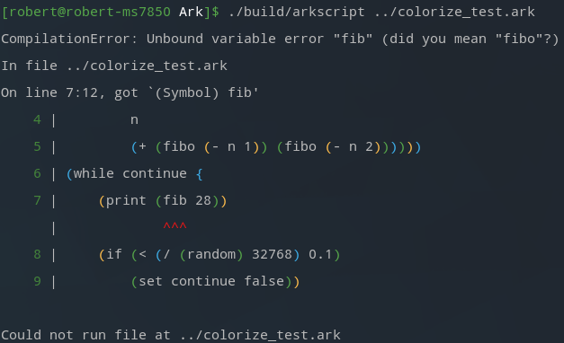

Hello there!

The project is still alive, I was just running out of content to make a new post here.

Between today and the last post, taking into account only the dev branch, a small refacto of the project has passed:

- 88 files modified,
- 3093 lines added,
- 1991 deleted

I specifically said the `dev` branch, because a little new one has appeared, aimed specifically at the next big release, ArkScript 4.0! It includes :

- better type errors (already available in 3.1.3),
- close symbol suggestion when an unbound symbol is encountered during compilation (3.2.0),
- conversion of closures into strings with their fields,
- addition of async/await as builtins,
- management of unused expressions that polluted the stack (which I mentioned in the previous post, available in 3.2.0),
- tail call optimization (3.2.0) when a function calls itself (will be generalized in 4.0),
- lots of fixes for annoying little bugs.

The work done since last year can be seen as clean-up and a bit of house keeping, as the vacations have arrived for part of the team, development is slowing down a little. However, we're planning some brilliant improvements for the rest of the year, including the generation of an AST in JSON form (useful for making an LSP, writing tests for the lexer/parser/optimizer/macro processor, for having a new backend that transpiles into WASM or other...), fuzzing to detect as many errors as possible in the language's implementation.

```lisp
(let size 1000)
(let data (list:fill size 1))  # une liste de remplie de mille 1
(let sum (fun (a b src) {
    (mut acc 0)
    (while (< a b) {
        (set acc (+ acc (@ src a)))
        (set a (+ 1 a))})
    acc
}))


(let workers [
    (async sum 0 (/ size 4) data)
    (async sum (/ size 4) (/ size 2) data)
    (async sum (/ size 2) (- size (/ size 4)) data)
    (async sum (- size (/ size 4)) size data)])

(let res-async
    (list:reduce
        (list:map
            workers
            (fun (w) (await w)))
        (fun (a b) (+ a b))))
```



```lisp
(let make (fun (a b c)
    (fun (&a &b &c) ())))

(let foo (make 1 2 3))
(print foo)  # output: (.a=1 .b=2 .c=3), avant: Closure<4>

functionName: needs argumentCount argument(s), got actualArgumentCount.
  -> arg1Name (wanted type) was arg1Value (of type arg1Type)
  -> arg2Name (wanted type) was arg2Value (of type arg2Type)
```

