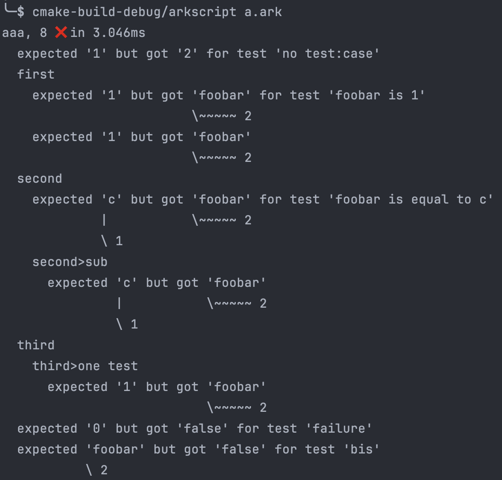
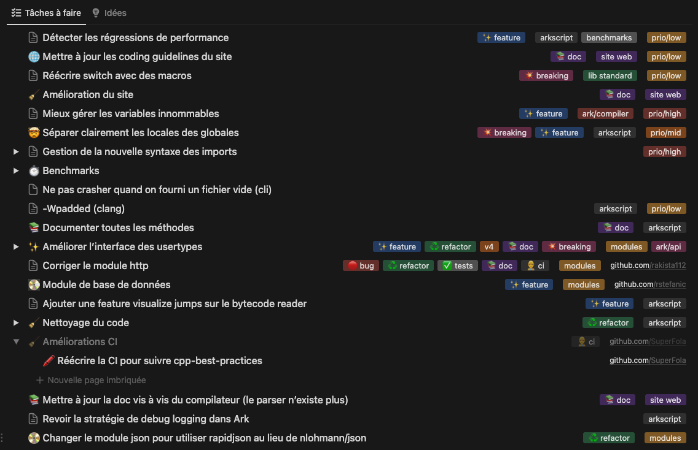

Hello again!

It's now been 581 days since I last posted here. In the meantime, that's around 21880 lines added and 18238 deleted in various refactos, divided into 202 commits (the year 2023 was very empty, work resumed at the start of 2024)!

## A parser? Again?

To continue from the end of the last message, the new parser has been permanently integrated into ArkScript, and the old one decommissioned. The integration was easier than expected if I remember correctly, with a lot of ugly, hard-to-maintain code gone.

And on top of that, over the last few months I've been able to optimize the parser a little more, which used to take a long time to calculate the cursor position in the file (not as easy as keeping a counter as we often go backwards, cf. [the monster that helps position line breaks](https://github.com/ArkScript-lang/Ark/blob/79bfe1f596b5a17ed4a684191adf0addd3507d25/src/arkreactor/Compiler/AST/BaseParser.cpp#L8-L33)). This gives us the following perf:

```
---------------------------------------------------------------------------
Benchmark                                 Time             CPU   Iterations
---------------------------------------------------------------------------
New parser - Simple - 39 nodes/0      0.045 ms        0.045 ms        15421 nodesAvg=92.526k nodesRate=132.633k/s uselessLines/sec=265.266k/s
New parser - Medium - 83 nodes/1      0.126 ms        0.126 ms         5514 nodesAvg=55.14k nodesRate=79.4941k/s uselessLines/sec=198.735k/s
New parser - Big - 665 nodes/2         1.66 ms         1.66 ms          422 nodesAvg=8.018k nodesRate=11.4657k/s uselessLines/sec=191.9k/s
```

(on exactly the same hardware, a Mac M1 Pro with 8 cores and 32GB RAM)

## Macro syntax evolves

Previously, the syntax of macros wasn't very pretty or logical:

```lisp
!{name 12}
!{if cond then else}
!{func (arg arg2) body}
```

Now we use the same syntax as the rest of the language with a magic token, `$`:

```lisp
($ name 12)
($if cond then else)
($ func (arg arg2) body)
```

And we've got new primitives like `$repr` to get a string from a node at compile time, `symcat` to concatenate symbols (useful in recursive macros defining temporary variables), `argcount` to get the number of arguments to a function. (I'll have to standardize the names so that they all start with `$`, it's in my backlog).

> [!NOTE]
> We could use pattern matching to extract the number of arguments for a node, but that's a complex thing to implement, and there's not enough need for it at the moment. What's certain is that it would be really cool to implement, if only for the experience, but given the state of the macro processor, it'll have to wait a little longer.

## More and more benchmarks

As I love numbers and stats of all kinds, I decided to add more benchmarks last year, with benchmarks for the VM I can run on my machine, and output CSVs. Add a pinch of Python and I can track perf evolutions at each commit if I wish, to track potential regressions. Pretty cool, eh?

You can see the evolution between several commits here, with losses in ms and % between each commit and the base (the 0-684ea758), successively:

```
                          |           | 0-684ea758   | 1-d45d7ea1         | 2-abb043b4          | 3-75161de7          | 4-ad889963
--------------------------+-----------+--------------+--------------------+---------------------+---------------------+---------------------
 quicksort                | real_time | 0.152787ms   | -0.008 (-5.3205%)  | -0.009 (-5.8277%)   | -0.009 (-6.2021%)   | -0.011 (-7.4961%)
                          | cpu_time  | 0.152334ms   | -0.008 (-5.3383%)  | -0.009 (-6.0518%)   | -0.010 (-6.2993%)   | -0.011 (-7.4757%)
 ackermann/iterations:50  | real_time | 81.2917ms    | -7.924 (-9.7471%)  | -12.798 (-15.7432%) | -12.939 (-15.9169%) | -14.163 (-17.4218%)
                          | cpu_time  | 80.9612ms    | -7.867 (-9.7172%)  | -12.764 (-15.7655%) | -12.980 (-16.0327%) | -14.116 (-17.4358%)
 fibonacci/iterations:100 | real_time | 7.51618ms    | -1.321 (-17.5797%) | -1.417 (-18.8548%)  | -1.392 (-18.5215%)  | -1.483 (-19.7270%)
                          | cpu_time  | 7.4984ms     | -1.324 (-17.6618%) | -1.421 (-18.9530%)  | -1.407 (-18.7577%)  | -1.484 (-19.7880%)
 man_or_boy               | real_time | 0.015211ms   | -0.000 (-1.2682%)  | -0.000 (-1.2839%)   | -0.000 (-2.1590%)   | -0.000 (-1.4010%)
                          | cpu_time  | 0.0151691ms  | -0.000 (-1.2855%)  | -0.000 (-1.4859%)   | -0.000 (-2.2711%)   | -0.000 (-1.7134%)
```

Not too bad, but I'd like to automate all that... That's why [benchmarks are now launched](https://github.com/ArkScript-lang/Ark/blob/79bfe1f596b5a17ed4a684191adf0addd3507d25/.github/workflows/benchmarks.yml#L62-L66) by the CI for each commit to `dev`. Don't worry, I'm not looking at time, as CI environments are not reproducible, but at the ratios between ArkScript and other languages, which can be viewed at [https://arkscript-lang.dev/benchmarks.html](https://arkscript-lang.dev/benchmarks.html).

## Switching to C++20

After that, I decided it was high time to switch to C++20 (also because I wanted to integrate [boost-ext/ut](https://github.com/boost-ext/ut), which is in C++20), and I took it upon myself to modernize the code (ranges & views make the code much clearer).

At the same time, I finally switched to CLion, and I think it was the best decision of my life. The integration with clangd is much better than VSCode and IntelliSense, even if CLion eats RAM like I eat donuts... (promise, this post isn't sponso, just having a debugger that doesn't just show me the asm is a life-changer; and being able to set breakpoints too).

The hardest part of this migration was adapting the CI to have compilers supporting C++20 (support for gcc < 13 and clang < 15 was dropped).

## A lot of testing

With my head in the CI, I also started writing a lot of tests, in C++ this time, to test the parser, the bytecode reader, the VM, the VM+State embedding, ... and honestly, it's all very stupid and easy to read, just look at this simplicity :

```cpp
ut::suite<"AST"> ast_suite = [] {
    using namespace ut;

    "[generate valid ast]"_test = [] {
        iter_test_files(
            "ASTSuite",
            [](TestData&& data) {
                JsonCompiler compiler(false, { ARK_TESTS_ROOT "lib/" });

                std::string json;
                should("parse " + data.stem) = [&] {
                    expect(nothrow([&] {
                        mut(compiler).feed(data.path);
                        json = mut(compiler).compile();
                    }));
                };

                should("output the expected AST for " + data.stem) = [&] {
                    expect(that % json == data.expected);
                };
            },
            /* expected_ext= */ "json");
    };
};
```

For very clear output and cool error reporting (when it crashes, which now rarely happens):

```
Suite 'global': all tests passed (0 asserts in 0 tests)
Suite 'BytecodeReader': all tests passed (15 asserts in 7 tests)
Suite 'AST': all tests passed (14 asserts in 15 tests)
Suite 'VM': all tests passed (18 asserts in 15 tests)
Suite 'Parser': all tests passed (50 asserts in 52 tests)
Suite '*hidden*': all tests passed (64 asserts in 32 tests)
```

## Fuzzing

I've also continued fuzzing, and I'm happy to say that I'm fuzzing approximately 3 times faster than before, thanks to a better parser and well-targeted optimizations (always fed by benchmarks and profiling beforehand)!

To help me with this task of sorting out 300+ outputs marked as KO by the fuzzers, I've made a few scripts ([sorting in python, a la git add -p](https://github.com/ArkScript-lang/Ark/blob/79bfe1f596b5a17ed4a684191adf0addd3507d25/tests/fuzzing/fuzzer-crash-triage.py), [launching the fuzzers with different parameters for better coverage](https://github.com/ArkScript-lang/Ark/blob/79bfe1f596b5a17ed4a684191adf0addd3507d25/tests/fuzzing/fuzz.sh)).

At the time of writing, I'm left with ~64 errors (some of which overlap, hence the usefulness of the python script to quickly sort out false errors (aka ArkScript flagging an error) and real errors (a sanitizer flagging a problem), having started from 400+ errors in 4 hours of fuzz testing!

Thanks to the fuzzers, the test base is also enriched, as we now also test errors and their reporting, to ensure that we don't make an error reappear and that everything is always handled correctly: [/tests/errors](https://github.com/ArkScript-lang/Ark/tree/79bfe1f596b5a17ed4a684191adf0addd3507d25/tests/errors) (organized by error category, with an .ark file and an .expected file for the bit of error message we're waiting for, I'm pretty proud of that).

## Better test reports for ArkScript

I didn't like having asserts in ArkScript, because the tests crashed immediately. You had to fix them one by one and the reporting was ugly, then restart everything. Inspired by mockito in Scala, I designed a test lib in ArkScript, for ArkScript. Check it out:

```lisp
(import std.Testing)

(test:suite aaa {
    (mut foobar 2)
    (test:eq 1 2 "no test:case")

    (test:case "given an explicit expected value" {
        (test:eq 1 foobar "foobar is 1")
        (test:eq 1 foobar)})

    (test:case "given a computed expected value" {
        (let c 1)
        (test:eq c foobar "foobar is equal to c")
        (test:case "nested case"
            (test:eq c foobar))})})
```

Which gives the following output:



## Running ArkScript code... online?

What could be better than a playground for testing the language, instead of cloning the repo and compiling the project on your own machine?

[https://playground.arkscript-lang.dev/](https://playground.arkscript-lang.dev/)

It's even been integrated into the language's tutorial page, so you can try out the examples straight away, while you learn: [https://arkscript-lang.dev/docs/tutorials/language](https://arkscript-lang.dev/docs/tutorials/language).

## More uniformity on the website

Right now, we're walking around with three different sites (four with the playground), and I don't like it:

- the showcase site, `/`, with tutorials, guidelines and examples
- the project's C++ documentation, `/impl`, for maintainers and external contributors (and... documentation for modules coded in C++?? alas yes)
- documentation for the standard lib, `/std`
- and the playground, of course

So a few months ago, I started to move all the documentation to the “main” site in `/`, so that only the implementation documentation would remain in `/impl`. Tutorials, integration guides and module creation guides are all on the main site! A single interface, easier to manage and maintain for me (the links page: [https://arkscript-lang.dev/documentation.html](https://arkscript-lang.dev/documentation.html)).

Eventually, module documentation will be absorbed via ArkDoc, our tool for generating documentation from comments in ArkScript code (and C++, builtins are documented with the same tool; with a little modification we should be able to document modules with it too).

## A code formatter

Astute readers may have noticed that a test was marked `*hidden*` above... it's the ArkScript Code Formatter test suite!

So it's official: the CLI has been equipped with a tool that can reformat a file in place or in dry-run (in which case the formatting that would have been done is simply written to the console). It's very opinionated and not at all configurable, a la gofmt: so no fuss, everyone will have to work the same way.

As soon as I'm sure it's stable and doesn't swallow comments by mistake, I'll format all the ArkScript code in the project with it (examples, standard lib, tests...)! Don't hesitate to test it and give feedback, it's by far the most complex piece of code in the project, despite its small size ([around 500 lines at the most](https://github.com/ArkScript-lang/Ark/blob/79bfe1f596b5a17ed4a684191adf0addd3507d25/src/arkscript/Formatter.cpp)).

I hope to be able to write an article about it, as the subject is very interesting and more complicated than it seems.

## Parting words

Small sneak peak of everything I still want to do on this project (one task down usually pushes two, or more):



I also realize that I have a tendency to make very long posts, I hope you enjoy/enjoy them as much as I enjoy writing them; it's true that posting once every 4 months (or rather 18 months in this case) helps to write such long posts, there's plenty to discuss!

I'll try to come back sooner next time ;)

