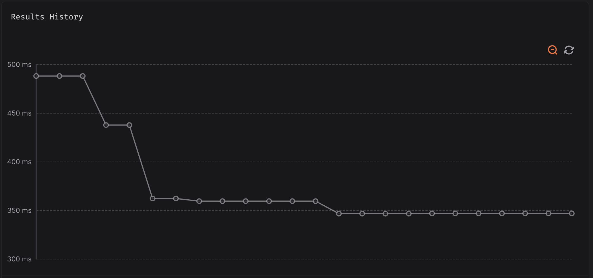

Since my [last update post](), there was a total of 941 files changed, 10'780 insertions and 4'105 deletions in 71 commits. I mainly focused on optimizing the runtime performances of the language.

## Better errors!

I worked on improving error contexts, by adding an optional cause, which is very helpful when debugging macros extensions:

```
At (foo 1 2) @ 4:2
    1 | (macro foo (a b c ...d)
      | ^ macro expansion started here
    2 |     (+ a b c ...d))
    3 |
    4 | (foo 1 2)
      |  ^~~~~~~
    5 |
        Macro `foo' got 2 argument(s) but needed at least 3
```

## Importing builtins

A small thing that should be mentionned nonetheless: builtins are now available through the standard library, meaning we can scope them!

```lisp
(import std.List :fill)

(fill 5 nil)  # [nil nil nil nil nil]
```

This was easy to implement, as I've just renamed builtins to `builtin__name`, and made proxies for them inside the standard library.

As an effort to not make builtin calls slower, I also introduced a super instruction for those proxied builtins, to avoid having to *push* arguments to call the proxy, then *load* arguments inside the proxy in variables, and *push* them again on the stack to call the builtin: we *push arguments once* and the super instruction takes care of popping the arguments, without using intermediate variables.

## Gotta go fast

In the previous article, I talked about integrating Codspeed in the project's CI, and [this is now done](https://codspeed.io/ArkScript-lang/Ark)! It helped a ton when improving the performances of the language, through more IR optimizations.

The language was already pretty decent performance wise, but after a post [I made on Reddit](https://www.reddit.com/r/ProgrammingLanguages/comments/1kova8b/trying_to_make_a_decentprofessional_looking/), trying to find a path to follow for the language, someone mentionned that "benchmarks do not look good". As anyone would have done, I didn't spiral and absolutely did not laser focused on improving the benchmarks.

So here we are a month later, with about 30ish new super instructions:

1. we now have instructions to compact a `load const`, `comparison`, `jump`, very useful to optimize loops and conditions ;
2. `call symbol`, to avoid having to resolve and push a symbol value, then pop it right after when performing the call ;
3. `get field from symbol`, to retrieve a field from a closure in a single instruction, removing intermediate push-pop ;
4. `at sym sym` to retrieve a value from a list in a single instruction ;
5. increment and decrement store in place: a single instruction replacing 4 instructions, removing intermediate push-pop ;
6. `check type of`, an instruction to replace `LOAD_SYMBOL`, `TYPE`, `LOAD_CONST`, `EQ` ;
7. `append in place to symbol`, to update a list in place in less instructions ;

### Better and/or shortcircuiting implementation

ArkScript did not have shortcircuiting implemented in 3.x versions. I explained how I first implemented shortcircuiting [in this article](https://lexp.lt/posts/shortcircuiting_in_bytecode_interpreter/), but as I looked back, i saw it was inefficient and could be improved to remove useless push-pop patterns.

We went from a

```
# (if (and 1 2) ...)
page_0
    LOAD_CONST 1
    DUP
    POP_JUMP_IF_FALSE L0
    POP
    LOAD_CONST 2
.L0:
    ...
```

to new instructions, `SHORTCIRCUIT_AND` and `SHORTCIRCUIT_OR`:

```
# (if (and 1 2) ...)
page_0
    LOAD_CONST 1
    SHORTCIRCUIT_AND L0
    LOAD_CONST 2
.L0:
    ...
```

Now, the shortcircuit operations take care of duplicating the value if needed (or remove it from the stack), as well as the jump if the condition is false (for `and`) or true (for `or`) early.

### Goodbye, weird stack manipulation!

I also took some time to improve ArkScript calling convention. We used to push arguments in the order they were given, and load them in the order they were declared, which conflicted when your intermediate storage is a LIFO stack.

```
# (foo 1 2 3)
push 1
push 2
push 3

# (let foo (fun (a b c) ...))
load a  # would be 3
load b  # = 2
load c  # = 1
...
ret
```

To solve this, the VM would reverse the last N elements on the stack (N being the number of arguments passed to call `foo` in this example), and add some state right before: the *instruction and page pointers* from right before the call, to know where the VM had to come back when encoutering a `RET` (return) instruction.

Now the compiler emits an explicit `push return address` instruction, to tell the VM to save its state on the stack before a function call, and the stack is not swapped anymore as arguments in function calls are now pushed in reverse order.

All those optimizations took us from 488ms to 346.7ms on the [Ackermann benchmark](https://codspeed.io/ArkScript-lang/Ark/benchmarks/tests/benchmarks/main.cpp::ackermann) on Codspeed (on my Mac M1 Pro, it takes about 33ms ; Codspeed measures instructions, not time, but translate it to time for easier reading):



---

See you next time, with hopefully less nerd snipping myself into optimizing the language, and more standard library updates!

