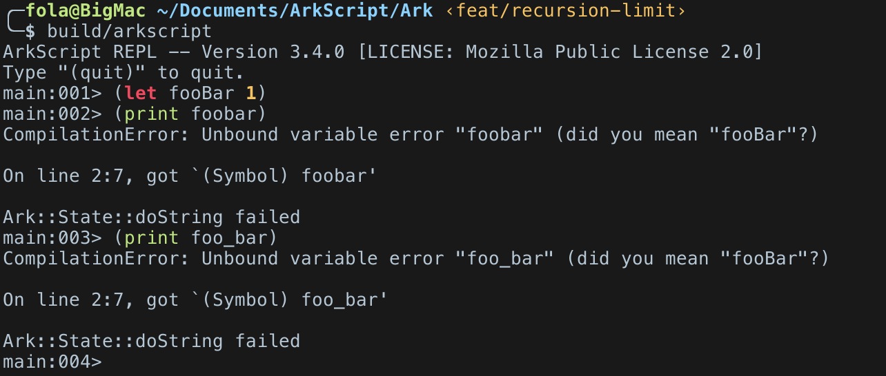
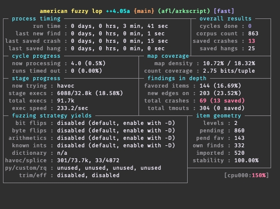
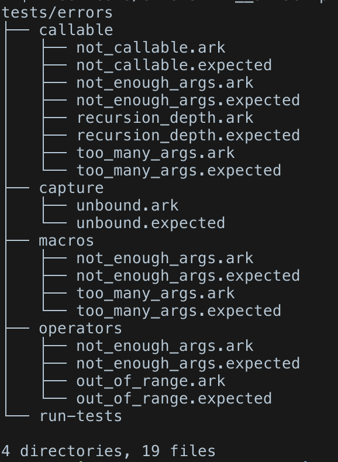
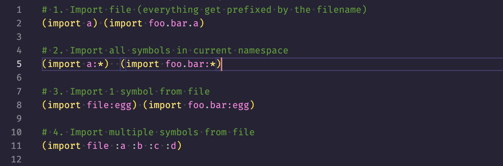

Good evening everyone!

Since the last post, I've taken some time to work on the language's error messages, to better help users when an error occurs, as well as more compile-time warnings:



---

I've started bug hunting by integrating [AFL++](https://github.com/AFLplusplus/AFLplusplus), a handy fuzzer which has brought to my attention quite a few bits of code able of crashing the lexer, parser, macro processor, rarely the compiler, and occasionally the virtual machine. In short, it's all good fun, at least my flat's nice and warm, and I've got bugs to fix until the end of the year.



To give some figures:

- 6 fuzzer instances ran, each for 1 hour
- the load average rose to 12 (on an 8-core/16-thread Xeon, that's not bad)
- RAM usage was capped at 64MB per instance
- an average of 500 crashes per instance
- an average of 1000 hangs per instance (it's good at generating `(while true ())` and the like)
- the CPU temperature climbed from 45° to 80°, and that of my apartment by +2° (who needs heating?)

I must have fixed a dozen or so bugs thanks to this, which is tedious but very interesting. Based on the reported crashes, I started a collection of “code that crashes but needs to be detected”.



A test being composed of two files, a `.ark` and a `.expected`.

```lisp
# input.ark
(())
```
---

```
# input.expected
TypeError: A Nil isn't a callable
```

---

As for progress on v4, I've rewritten bits of the compiler and cleaned up the code to make it easier to read, and finished integrating the new bytecode format, where each instruction is 4 bytes long, which makes peeking much easier.

A new syntax for imports is also planned:



The more attentive will have noticed that this syntax will prevent the inclusion of parent folder scripts, which was currently possible with an `(import "../file.ark")`. I think this is a minor inconvenience that will prompt you to think a little more carefully about the structure of a project, but it shouldn't be catastrophic.

> [!WARNING]
> However, this new syntax is not set in stone. Although the current meaning of `(import folder.foo.bar)` is “import folder/foo/bar.ark from the current script folder”, this may be re-evaluated to follow Scala-style packages.
> 
> Thus, if we run `main.ark`, which imports `foo/bar.ark`, and the latter wants to make a `(import bacon.yellow.color)`, we would search for `bacon/yellow/color.ark` from the `main.ark` execution folder and not from the folder where `bar.ark` is present.

---

Aside from these QoL improvements, I've been working on a new parser for the language for nearly two weeks now, the source of which you can find on GitHub: [https://github.com/SuperFola/parser-combinators](https://github.com/SuperFola/parser-combinators). Indeed, the current lexer/parser is difficult to maintain, almost impossible to evolve without breaking something, and surely stuffed with bugs I haven't found yet.

That's why I've tried a parser combinators approach, and the result is 2 times less code, 2 times easier to read, and performance that I consider correct (I'll have to measure the current parser to be able to compare though). To top it all off, 0 warnings (Wall, Wextra, Wconversion, Wshadow and pedantic, I'm crazy), 0 memory leaks, tests in all directions and soon fuzzing.

```
Running ./build/bench
Run on (8 X 24.121 MHz CPU s)
CPU Caches:
  L1 Data 64 KiB
  L1 Instruction 128 KiB
  L2 Unified 4096 KiB (x8)
Load Average: 1.29, 1.69, 1.91
------------------------------------------------------------
Benchmark                  Time             CPU   Iterations
------------------------------------------------------------
Simple - 39 nodes      0.067 ms        0.067 ms       103688
Medium - 83 nodes      0.395 ms        0.395 ms        17430
Big - 665 nodes         31.9 ms         31.8 ms          224
```

See you soon!

