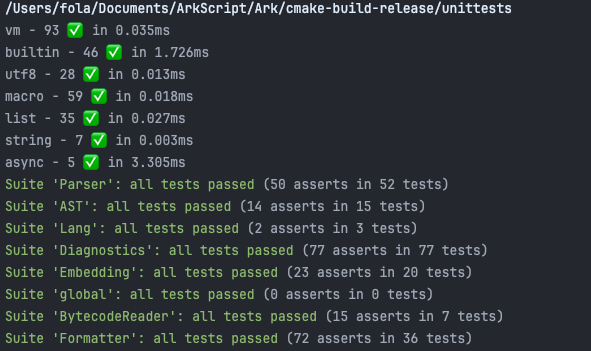

Hello, General Kenobii!

In the last 90 days, 795 files have been modified, for 3105 insertions and 9135 deletions (dataset cleanup for fuzzers), in just 97 commits (I'm reworking the very last one, more on that soon).

## Did someone say... macros?

Macros come in handy for improving syntax and creating DSLs like the one used for testing:

```lisp
(test:suite list {
    (test:case "append and return a new list" {
        (test:eq (append a 4) [1 2 3 4])
        (test:eq a [1 2 3])
        (test:eq (append a a) [1 2 3 [1 2 3]])
        (test:eq a [1 2 3]) })})
```

Except that, as `test:suite`, `test:case` and `test:eq` (and derivatives) are macros, all their arguments are evaluated (if possible) by the macro processor. Including an `(@ (list 1 2 3) 0)` which would return... the builtin `list` and not `1`.

We lack a quoting / unquoting / quasiquoting system! And that's a pretty big impact on syntax, which I'm not ready to make yet, wanting to keep the language as simple as possible. An intermediate solution was to introduce a new macro that stops evaluation in a macro, by taking a block of code and pasting it as is into the code: `($paste node)`.

So all `test:eq` arguments are passed into `$paste` to avoid unwanted evaluation, and all's well!

> [!NOTE]
> The name `$paste` is temporary, I haven't found anything better at the moment. Don't hesitate if you have any suggestions.

## Tooling, here we go

Developing a language is one thing. Ensuring that it works as intended at all times is even better. That's why we have tests, but we can do much more than that! Like **benchmarks** to track down performance regressions, and **fuzzing** for automatic bug detection. We can even guide test writing with code analysis, such as **coverage**. As you may have guessed, I've done all 3 (4 if you count tests).

I've already told you about benchmarks and my script for calculating the differences in perf between different commits, and now we're also measuring parser and compiler performance.

```
New parser - Simple - 39 nodes/0      0.045 ms        0.045 ms        15467 nodesAvg=92.802k nodesRate=132.546k/s uselessLines/sec=287.183k/s
New parser - Medium - 83 nodes/1      0.130 ms        0.129 ms         5405 nodesAvg=54.05k nodesRate=77.3058k/s uselessLines/sec=193.265k/s
New parser - Big - 665 nodes/2         1.74 ms         1.73 ms          405 nodesAvg=7.695k nodesRate=10.958k/s uselessLines/sec=183.402k/s
Welder - Simple - 39 nodes/0          0.164 ms        0.164 ms         4207
Welder - Medium - 83 nodes/1          0.309 ms        0.308 ms         2249
Welder - Big - 665 nodes/2             5.33 ms         5.32 ms          130
```

If we compare with the performance of the parser in the previous post, we remain within the expected range, with some slight variations but nothing catastrophic. The new statistics are those of the *welder*, which chains the parser, import solver, macro processor, ast optimizer, name and scope resolver and compiler. Six different passes one by one, not too bad in itself to be able to compile a file of 319 lines and 665 nodes in 5ms!

### A word about the compiler

The more attentive will have noticed two things: “name and scope resolver” and “six different *passes*”.

I've recently broken down the compiler into a series of passes, each of which takes an AST and outputs an AST (except for the parser, which takes a file and outputs an AST, and the compiler, which takes an AST and outputs bytecode), and a new one has appeared, taken out of the compiler: a name and scope resolver.

It checks that you're only using *declared* and *valid* variables (you can't name a variable “print” or any other builtin), and suggests alternatives in error messages if necessary (eg fog -> foo?) based on existing variables and a Leveinshtein distance. Scope resolution can detect *unbound* variables, which exist later and are referenced before they are used.

### More tooling

ArkScript finally has coverage! It sounds simple enough, and it is when you understand how to set it up. The hardest part of the job was consolidating the tests into a single executable so that we could do the coverage in one fell swoop. Without that, you'd have to play around with attaching `.gcda` and/or `.gcno` files, as I understand it, and I didn't want to bother with that (plus it simplifies test launching enormously: no need for complicated bash scripts, just a single target `unittests` that launches all the suites).



Two new suites: `Lang` (unittests in ArkScript), and `Diagnostics` (validation of error messages, divided into two categories: runtime and compile time).

Current coverage is [73%](https://coveralls.io/github/ArkScript-lang/Ark). Not bad, but can do better. In the days and weeks to come I'll be adding tests to increase test coverage, *although 100% coverage doesn't mean we've got no bugs, just that the code is running* (100% coverage is not a goal, neither achievable nor desirable).

### Formatting code

As the ArkScript code formatter has become more stable, we now have a [github action](https://github.com/ArkScript-lang/action-format) to check that code is formatted correctly in the CI.

## Still fewer bugs?

The good news is that, thanks to fuzzing, I've been able to fix a whole host of bugs:

- macro processor crashes due to unlimited recursive evaluation,
- invalid utf8 characters read by the parser that generated crashes,
- futures that couldn't be awaited several times,
- and many others that you can find here: [Changelog.md](https://github.com/ArkScript-lang/Ark/blob/39cfc80ec3b2a07a38b46c7bec4d05495b9edfac/CHANGELOG.md#changed), for a total of 25 bugs already fixed, which now have their own dedicated test to prevent regressions.

## Final words

I'm currently working on a small optimization (guided by numerous benchmarks and much skepticism), **computed goto** in the virtual machine. At the moment, I'm seeing a 10% performance gain on the most demanding tests, still on the same machine (MacBook Pro M1, 8 cores).


Currently, 75 tasks have been completed, 3 are in progress, 19 need more detail (still in the idea stage) and 33 have yet to be done (and 5 have been abandoned). One completed task gives rise to 1 or 2 others, but we're getting there little by little.

If everything continues as is, you'll see me on December 24 for the next update. Otherwise, happy New Year and see you in 2025!

